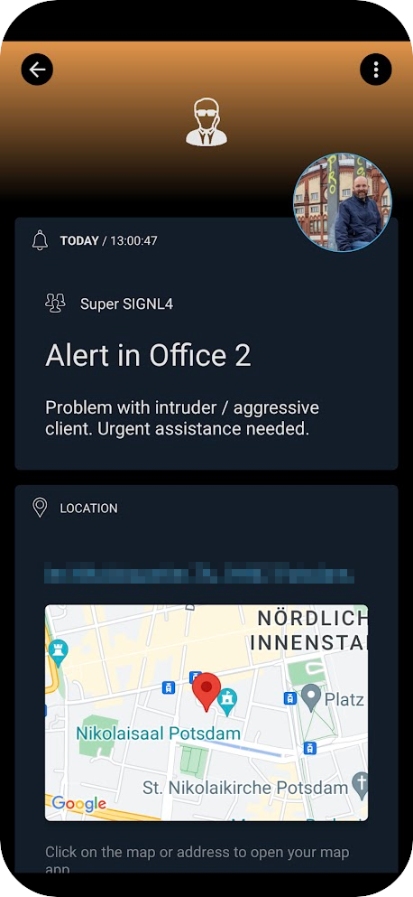

# SIGNL4 Alert by Windows Shortcut

There are various options to trigger SIGNL4 alerts manually, e.g. from the web portal, mobile app, by clicking a button or via email.

As simple way to trigger an alert from your Windows machine is to use a shortcut on your desktop or a keyboard shortcut.

This allows employees to (silently) trigger an alert from their desk when there is a threatening situation, e.g. an aggressive client.

You just need to PowerShell script to trigger the alert and a Windows shortcut.

## PowerShell

The file "signl4_alert.ps1" contains the command to trigger the SIGNL4 alert. You need to change it to use your SIGNL4 team or integration secret. You can also adapt the title and message to match your needs.

You can place the file somewhere on your Windows machine, e.g. under C:\Scripts\.

## Windows Shortcut

Now, you create a Windows shortcut on your desktop to execute the PowerShell file.

The Target is the following:

```powershell
C:\Windows\System32\WindowsPowerShell\v1.0\powershell.exe -NoProfile -WindowStyle Hidden -ExecutionPolicy Bypass -File "C:\Script\signl4_alert.ps1"
```

You can also configure a shortcut key to quickly trigger the alert by a keyboard shortcut, e.g.  

CTRL + ALT + A  

That's it. The alert in SIGNL4 might look like this.  


